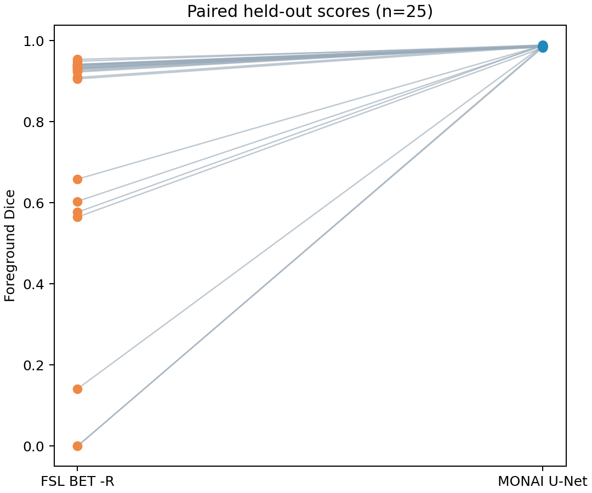
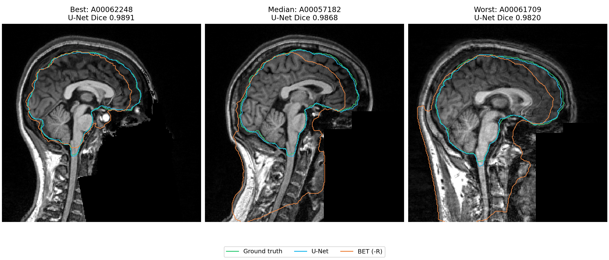
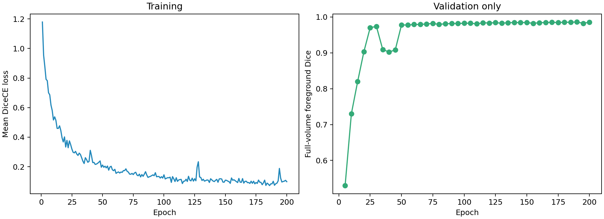
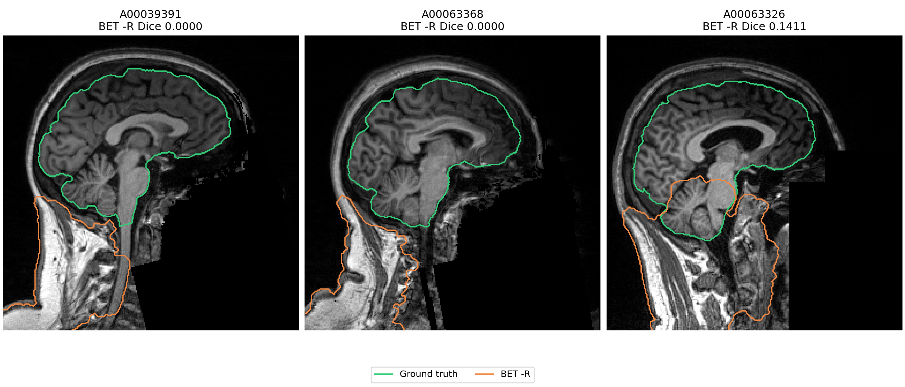

# Deep Learning Brain Extraction on NFBS (MONAI 3D U-Net)

<!-- RESULTS:START -->
A MONAI 3D U-Net achieves Dice **0.99** on **25** held-out NFBS T1w scans, **21.3 points above** fixed FSL BET (-R, uncropped scans; paired Wilcoxon p = 5.96046e-08).

| Method | Dice mean ± SD | Dice median | HD95 mm mean ± SD | p vs U-Net |
|---|---:|---:|---:|---:|
| MONAI 3D U-Net | 0.9863 ± 0.0018 | 0.9868 | 1.43 ± 0.19 | — |
| FSL BET (default, -f 0.5) | 0.7581 ± 0.1199 | 0.7735 | 46.54 ± 27.25 | 5.96046e-08 |
| FSL BET (-R, -f 0.5) (selected) | 0.7734 ± 0.3014 | 0.9301 | 32.92 ± 41.66 | 5.96046e-08 |

The selected BET setting has 7/25 cases with Dice <0.8 and 2 zero-overlap masks. Its median Dice is 0.9301; the median paired U-Net gain is 5.7 points. The larger mean gain is influenced by these BET failures. This comparison uses the two fixed commands on uncropped inputs, and is not a comparison against a neck-cropped or otherwise optimized FSL pipeline. The [NFBS paper](https://link.springer.com/article/10.1186/s13742-016-0150-5) reported BET Dice 0.893 ± 0.027 using FSL 5.0.7 with `bet -B` (bias-field and neck cleanup), not the default/-R settings evaluated here. That published reference is a different protocol.
<!-- RESULTS:END -->





Supplementary baseline review: the three lowest-scoring BET -R cases retain the original grid and place much of the mask in the neck. Native-grid checks and world-coordinate centroids are recorded in [baseline QC](results/baseline_qc.json); no cases were excluded and no test-time parameters were changed.



The source dataset contains 125 defaced 1 mm T1w scans and brain masks. Subject IDs are sorted, shuffled with Python `random.Random(42)`, and split into **85 train / 15 validation / 25 test**. Only the source T1w and mask are used. See [the frozen split](splits/split.json), [data audit](results/data_audit.json), and [protocol](docs/protocol.md).

## Reproduce

Use Python 3.12 on Linux/WSL and an NVIDIA GPU with at least 12 GB VRAM. CUDA 12.8 PyTorch is pinned for the RTX 5070. FSL BET must be available on `PATH`, with `FSLDIR` pointing to its environment, and the system `dc` calculator installed (`sudo apt-get install dc` on Ubuntu) for the robust variant. FSL is installed separately from the training environment.

```bash
python -m venv .venv
source .venv/bin/activate
pip install -r requirements.txt
python -m scripts.download_data
python -m src.make_split
python -m src.qc
python -m pytest -q
python -m scripts.smoke
python train.py --config configs/config.yaml
bash scripts/run_bet.sh
python evaluate.py
```

`bash scripts/run_project.sh` runs data audit, preprocessing QC, training (automatically resumes an existing checkpoint), both BET baselines and final evaluation. Download data and install dependencies first. `python train.py --resume` resumes a stopped run. All relative paths resolve against this repository, independently of the current directory.

After data, trained weights and both BET masks are present, **`python evaluate.py`** recomputes the 75 metric rows, statistics, figures and README result block. If U-Net predictions are absent, it generates them from the frozen best checkpoint. The first evaluation records checkpoint/config/split and input-mask hashes; changes are rejected on replay. Recomputing the same frozen analysis is permitted; changing model decisions after viewing test scores is not.

To replay the measured experiment without retraining, clone [the public repository](https://github.com/hennyi-yin/monai-brain-extraction) and install `requirements-lock.txt`. Download the assets from [Release v1.0.0](https://github.com/hennyi-yin/monai-brain-extraction/releases/tag/v1.0.0) into `artifacts/release/` (or use the prepared local folder), then run:

```bash
python -m scripts.download_data
mkdir -p checkpoints
cp artifacts/release/best.pt checkpoints/best.pt
tar -xzf artifacts/release/test_predictions.tar.gz
python evaluate.py
python -m scripts.audit_delivery
```

The release provides all 75 prediction masks plus manifests. The repository provides the frozen split, protocol and completion metadata. Scoring existing masks works on CPU; generating new U-Net predictions uses the configured CUDA device. Verify the release files against `SHA256SUMS.json` before replay.

For this machine, see [the local run instructions](docs/local_run.md). Exact installed transitive dependencies are recorded in `requirements-lock.txt`, and FSL package builds in `environment-fsl-explicit.txt`. GPU/driver/library differences may cause small numerical differences in new training runs.

The completed experiment was replayed in a fresh isolated environment installed from the lock file: all 47 pinned package versions matched, eight protocol tests passed, and `python evaluate.py` reproduced the 75-row CSV byte for byte. [Reproduction evidence](results/reproducibility.json).

Some source masks contain fractional voxels in [0,1]. All training, validation and final evaluation labels use the same **≥0.5** threshold; counts are retained in the data audit.

## Implementation

MONAI `UNet`: 3D, one input channel, two output classes, channels 16/32/64/128/256, strides 2/2/2/2, two residual units, InstanceNorm. Images are reoriented to RAS without interpolation and normalized using nonzero-voxel z-scores. Random 96³ patches use foreground/background sampling weights 1:1, left/right flips and small affine rotation/scaling, with nearest-neighbor interpolation for masks.

The loader takes two subjects and two crops per subject, producing **four patches per optimizer step**. Two crops (rather than the example's four) are the project brief's 12 GB memory fallback, fixed before training. AdamW uses lr 1e-4 and weight decay 1e-5; loss is DiceCE with CUDA mixed precision. Full-volume validation runs every five epochs, with a 200-epoch ceiling and early stopping after 30 epochs without improvement. Checkpoints and epoch-average loss/validation logs are saved every epoch; validation uses the same postprocessing as inference.

Inference uses 96³ sliding windows, 0.5 overlap, constant blending, largest foreground connected component (6-connectivity) and hole filling. Windows execute on GPU; the full-volume output is accumulated on CPU. Predictions are restored by inverse axis permutations/flips to the **original shape and affine**, saved as uint8 binary NIfTI. No resampling or image-guided mask trimming is used.

Dice and HD95 are foreground-only. HD95 uses physical voxel spacing and the maximum of the two directed 95th-percentile surface distances, matching MONAI's convention. Empty prediction masks score Dice 0 and HD95 infinity. Subject-aligned, two-sided paired Wilcoxon tests and sample SD (`ddof=1`) are reported. All-zero paired differences yield p=1.

Both fixed BET commands are evaluated: `-f 0.5 -m -n` and `-f 0.5 -R -m -n`. The higher test mean Dice chooses the reported baseline as specified in the brief. This is test-based baseline selection, and the associated p-value is descriptive and unadjusted; both variants remain visible. The U-Net is selected exclusively using validation data. Full precision means determine the resume delta; displayed Dice uses two decimals and the delta uses one decimal.

## Outputs

- `results/per_subject.csv`: 25 subjects × three methods, columns `id,method,dice,hd95`.
- `results/summary.md` and `summary.json`: statistical table and exact resume wording.
- `results/figures/`: paired scores, fixed central sagittal overlays (best/median/worst by U-Net Dice), training curves and three training-subject preprocessing checks.
- `logs/training.csv`, `run_config.json`, `environment.json`, `completed.json`: training evidence.
- `checkpoints/best.pt`, `last.pt`: weights plus optimizer/scaler/random state for resumption; excluded from Git.

`python -m scripts.audit_delivery` verifies completed artifacts against R1–R10, including all 75 native-grid binary masks. `python -m scripts.package_release` prepares release assets and SHA-256 checksums in the ignored `artifacts/release/` directory.

After committing the final files, `python -m scripts.package_delivery` creates a local ZIP containing the committed source/results and verified release assets. Raw NFBS scans must be downloaded with the included script for replay; the personal resume is delivered separately.

Raw data, persistent cache, mask volumes and checkpoints are excluded from Git. Publish the weights and mask archive as release assets rather than committing them. [Delivery checklist](docs/delivery.md).

## Data and citations

NFBS masks were produced with BEaST, visually reviewed, and corrected where required (85 edited, 40 accepted without edits). All 125 labels are provided by the dataset; do not describe every case as manually edited. Data download and provenance: [NFBS project](https://preprocessed-connectomes-project.org/NFB_skullstripped/), [source repository](https://github.com/preprocessed-connectomes-project/NFB_skullstripped).

Puccio B, Pooley JP, Pellman JS, Taverna EC, Craddock RC. *The preprocessed connectomes project repository of manually corrected skull-stripped T1-weighted anatomical MRI data*. GigaScience 5, 45 (2016). [doi:10.1186/s13742-016-0150-5](https://doi.org/10.1186/s13742-016-0150-5).

Smith SM. *Fast robust automated brain extraction*. Human Brain Mapping 17(3):143–155 (2002). [doi:10.1002/hbm.10062](https://doi.org/10.1002/hbm.10062). [FSL BET documentation](https://fsl.fmrib.ox.ac.uk/fsl/docs/structural/bet.html).

MONAI Consortium. *MONAI: An open-source framework for deep learning in healthcare*. [arXiv:2211.02701](https://arxiv.org/abs/2211.02701). [MONAI 1.6.1](https://pypi.org/project/monai/1.6.1/).

## Limitations

This is an internal held-out evaluation from a single dataset. It does not establish clinical performance or cross-dataset robustness. Artificial degradation experiments and an augmentation ablation are optional follow-up work, and are not part of the primary results. No external neuroimaging laboratory data is used.

[中文面试准备](docs/interview.md). This project's code is MIT-licensed; external data and FSL retain their own terms.


## Supplementary baseline (post hoc): robustfov + BET -R

On the same 25 held-out scans, the post-hoc robustfov + BET -R baseline achieves Dice 0.9178 ± 0.0154; the frozen U-Net's mean paired gain is 6.86 points (25/25 wins).

| Method | Dice mean ± SD | Median | Min | n < 0.8 | HD95 median (mm) | p vs U-Net |
|---|---:|---:|---:|---:|---:|---:|
| U-Net (frozen) | 0.9863 ± 0.0018 | 0.9868 | 0.9820 | 0 | 1.41 | — |
| BET -R (frozen) | 0.7734 ± 0.3014 | 0.9301 | 0.0000 | 7 | 9.51 | 5.96046e-08 |
| robustfov + BET -R (post hoc) | 0.9178 ± 0.0154 | 0.9174 | 0.8830 | 0 | 10.72 | 5.96046e-08 |

Chosen after viewing test scores; all 25 subjects and the pre-declared pipeline are retained. The frozen primary analysis above is unchanged. See the [addendum](docs/protocol.md#addendum-2026-10-08-post-hoc-supplementary-baseline), [supplementary summary](results/supplementary/robustfov_bet/summary.md) and [command/geometry manifest](results/supplementary/robustfov_bet/manifest.json).
