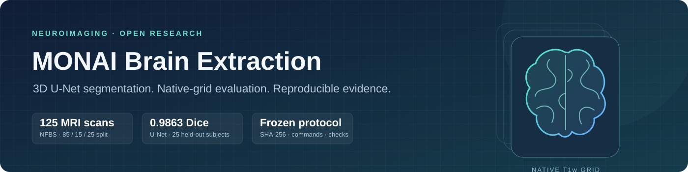
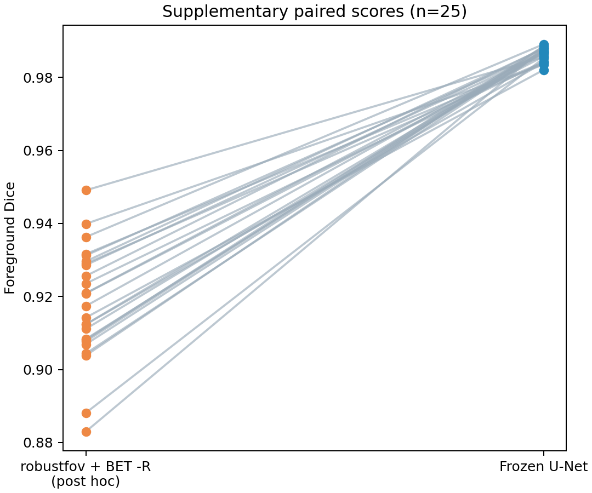
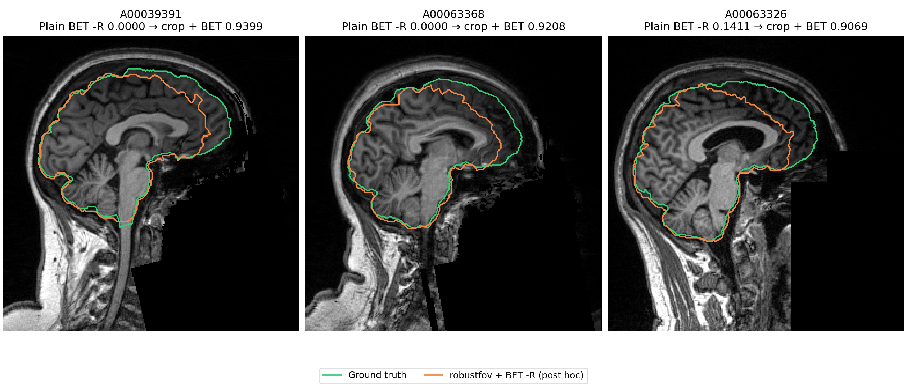

<p align="center">
  
</p>

<p align="center">
  <a href="https://github.com/hennyi-yin/monai-brain-extraction/actions/workflows/tests.yml"></a>
  <a href="https://github.com/hennyi-yin/monai-brain-extraction/releases/tag/v1.1.1"></a>
  <a href="splits/split.json"></a>
  <a href="LICENSE"></a>
</p>

<p align="center">
  <a href="#results">Results</a> ·
  <a href="docs/reproduce.md">Reproduce</a> ·
  <a href="docs/methods.md">Methods</a> ·
  <a href="docs/protocol.md">Protocol</a> ·
  <a href="https://github.com/hennyi-yin/monai-brain-extraction/releases/tag/v1.1.1">Weights &amp; masks</a>
</p>

A reproducible brain-extraction benchmark comparing a **MONAI 3D U-Net** with fixed **FSL BET** baselines on native T1w MRI. The project includes completed training, subject-level scores, visual quality checks, verified weights and all prediction masks.

- **Fixed held-out evaluation:** 85 training / 15 validation / 25 test subjects, seed 42; checkpoint selected on validation data.
- **Traceable outputs:** native-grid masks, exact commands, dependency locks and SHA-256 manifests.
- **Transparent comparison:** frozen primary analysis plus one explicitly labeled post-hoc neck-cropping baseline.

## Results

The U-Net achieves **0.9863 ± 0.0018 Dice** on the 25 held-out NFBS scans. This is a single-dataset research evaluation; external generalization and clinical performance have not been established.


<details>
<summary><strong>Frozen primary analysis — full results and BET failure caveats</strong></summary>

<!-- RESULTS:START -->
A MONAI 3D U-Net achieves Dice **0.99** on **25** held-out NFBS T1w scans, **21.3 points above** fixed FSL BET (-R, uncropped scans; paired Wilcoxon p = 5.96046e-08).

| Method | Dice mean ± SD | Dice median | HD95 mm mean ± SD | p vs U-Net |
|---|---:|---:|---:|---:|
| MONAI 3D U-Net | 0.9863 ± 0.0018 | 0.9868 | 1.43 ± 0.19 | — |
| FSL BET (default, -f 0.5) | 0.7581 ± 0.1199 | 0.7735 | 46.54 ± 27.25 | 5.96046e-08 |
| FSL BET (-R, -f 0.5) (selected) | 0.7734 ± 0.3014 | 0.9301 | 32.92 ± 41.66 | 5.96046e-08 |

The selected BET setting has 7/25 cases with Dice <0.8 and 2 zero-overlap masks. Its median Dice is 0.9301; the median paired U-Net gain is 5.7 points. The larger mean gain is influenced by these BET failures. This comparison uses the two fixed commands on uncropped inputs, and is not a comparison against a neck-cropped or otherwise optimized FSL pipeline. The [NFBS paper](https://link.springer.com/article/10.1186/s13742-016-0150-5) reported BET Dice 0.893 ± 0.027 using FSL 5.0.7 with `bet -B` (bias-field and neck cleanup), not the default/-R settings evaluated here. That published reference is a different protocol.
<!-- RESULTS:END -->


The original scores, model outputs and generated result block remain byte-identical. [Primary summary](results/summary.md) · [Per-subject scores](results/per_subject.csv) · [Original BET failure overlays](results/figures/bet_failure_qc.png).

</details>

## Supplementary baseline (post hoc): robustfov + BET -R

On the same 25 scans, the post-hoc neck-cropped baseline achieves **0.9178 ± 0.0154 Dice**, with a **6.86-point mean paired U-Net gain** and **25/25 U-Net wins**.

| Method | Dice mean ± SD | Median | Dice <0.8 | HD95 median (mm) |
|---|---:|---:|---:|---:|
| **MONAI 3D U-Net** | **0.9863 ± 0.0018** | **0.9868** | **0/25** | **1.41** |
| BET -R · primary, uncropped | 0.7734 ± 0.3014 | 0.9301 | 7/25 | 9.51 |
| robustfov + BET -R · post hoc | 0.9178 ± 0.0154 | 0.9174 | 0/25 | 10.72 |

Cropping recovers all seven previous failures, but lowers Dice in the other 18 cases: its mean gain over plain BET -R is +14.43 points and its median change is −0.99 points. The large primary mean gap is affected by severe neck failures. The supplementary pipeline was chosen **after viewing test scores**, pre-declared in a separate commit, and scored once without tuning or exclusions. It does not replace the primary analysis.



<details>
<summary><strong>Visual check: three previous neck-localized BET failures</strong></summary>



All 25 map-back checks passed with exact ROI image identity and preserved mask voxel counts. Minimum ground-truth brain retention in the crop was **99.9987%**. No supplementary subject failed.

</details>

[Protocol addendum](docs/protocol.md#addendum-2026-10-08-post-hoc-supplementary-baseline) · [Full supplementary statistics](results/supplementary/robustfov_bet/summary.md) · [Commands & geometry manifest](results/supplementary/robustfov_bet/manifest.json)

## Reproduce

The [v1.1.1 release](https://github.com/hennyi-yin/monai-brain-extraction/releases/tag/v1.1.1) provides the best checkpoint, inference weights, **100 native-grid prediction masks** and checksums. Existing masks can be audited on CPU; training and new U-Net inference use CUDA.

```bash
git clone https://github.com/hennyi-yin/monai-brain-extraction.git
cd monai-brain-extraction
python3.12 -m venv .venv
source .venv/bin/activate
pip install -r requirements-lock.txt
```

Follow the [reproduction guide](docs/reproduce.md) to download and verify the assets, restore masks, run the audits, or train independently. The primary CSV was reproduced byte for byte in a fresh locked environment. The completed supplementary evaluation is guarded against repeated scoring.

## Project map

| Start here | Contents |
|---|---|
| [Methods](docs/methods.md) | Dataset, architecture, preprocessing, inference, metrics and limitations |
| [Protocol](docs/protocol.md) | Frozen primary decisions and the dated post-hoc addendum |
| [Source](src/) / [tests](tests/) | MONAI pipeline, FSL runners, evaluation and native-grid roundtrip tests |
| [Primary results](results/summary.md) | 75 metric rows across three fixed methods; training and QC figures |
| [Supplementary results](results/supplementary/robustfov_bet/summary.md) | 25 extra metric rows, comparisons, commands and map-back evidence |
| [Training record](logs/) | 200-epoch history, selected checkpoint metadata and environment |

## Data & references

NFBS provides 125 defaced T1w scans and BEaST-derived brain masks, visually reviewed and corrected where needed (85 edited; 40 accepted without edits). The download script retains the source data. Code is [MIT-licensed](LICENSE); NFBS data and FSL retain their own terms.

- **NFBS:** Puccio et al. (2016), [manually corrected skull-stripped T1w MRI repository](https://doi.org/10.1186/s13742-016-0150-5). [Dataset](https://preprocessed-connectomes-project.org/NFB_skullstripped/).
- **BET:** Smith (2002), [Fast robust automated brain extraction](https://doi.org/10.1002/hbm.10062). [FSL documentation](https://fsl.fmrib.ox.ac.uk/fsl/docs/structural/bet.html).
- **MONAI:** MONAI Consortium, [An open-source framework for deep learning in healthcare](https://arxiv.org/abs/2211.02701).
